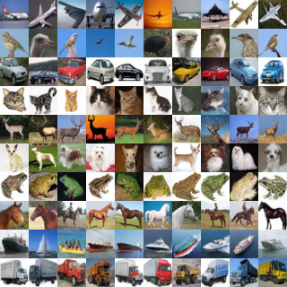

# Class Conditional Diffusion

## Introduction

In this repository, we explore different concepts from the current state of the art with respect to Diffusion models for controlled image generation. We train from scratch a custom made Unet to predict noise at a given timestep, and apply it to CelebA-HQ, CIFAR10 \& MNIST datasets to generate samples from their corresponding distributions.    
🚩 **__Disclaimer:__** __All__ faces in this repository are **__generated__** (ie, fictional / for educational purposes).

<div align="center">
  
</div>

In particular, we follow the paradigm by [Ho et al.](https://arxiv.org/pdf/2006.11239), using $$L_{simple}$$, to regress over the noise with a few twists: The noise schedule is smoother (ie, noise variance follows cosine transitions), similar to [Nichol \& Dhariwal](https://arxiv.org/pdf/2102.09672). The timestep embeddings are sinusoidal (sine-cosine waves) like the positional embeddings described by [Vaswani et al.](https://arxiv.org/pdf/1706.03762), they are applied via a FiLM like mechanism similar to [Perez et al.](https://arxiv.org/pdf/1709.07871). Their projected parameters are shared across the Unet. For class conditioning, the class representations are either one hot encodings or multi one hot encodings, depending on the dataset, and they are modulated via a cross-attention layer à la Stable Diffusion [Rombach \& Blattmann et al.](https://arxiv.org/pdf/2112.10752), at the bottleneck level only. Self-attention is also added at the bottleneck level, as well as at mid-resolution sections. Class conditioning is not randomly dropped in this implementation.    

<div align="center">
  
</div> 

The Unets used for CelebA-HQ $$(256^2\rightarrow16^2)$$ and CIFAR10 $$(32^2\rightarrow2^2)$$ are identical, they are made up of two residual blocks of 4 levels + a bottleneck. Self-attention is placed between the residual blocks. At the bottleneck section, self-attention it is chained with cross-attention. Downsampling is done via strided convolutions. Upsampling path is realized via nearest neighbors followed by a convolution. For MNIST, I used a very simple, and small Unet without any attention. Anything works with MNIST basically!    

<div align="center">
  
</div> 

All results are from EMA checkpoints. For caclulating EMA weights, I am using the ema_pytorch class from [lucidrains](https://github.com/lucidrains/ema-pytorch) repo, but it's also available via `pip install ema-pytorch`. All models were trained with mixed precision, using `bfloat16`.


## General Requirements
- `Python >= 3.8`
- `PyTorch`
- `Torchvision`
- `Einops` 
- `NumPy`
- `Pandas`
- `Matplotlib` 
- Other libraries: `PIL`, `PyYAML`
- Datasets used: `CelebA-HQ` $$(1024^2\rightarrow256^2)$$, `CIFAR10`, `MNIST`

## Installation & Usage

1. Clone the repository:
   ```bash
   git clone https://github.com/ntat/Class-Conditional-Diffusion.git
   ```
2. Install dependencies via `pip`:
   ```bash 
   pip install -r requirements.txt
   ```
3. Make sure you have the datasets and adjust `config.yaml` 
4. Run the script with `python`:
   ```bash 
   python main.py
   ```
5. For inference, look into the `notebooks` section to see how to interact with the code. 

# Results
## CIFAR10
Each row corresponds to one of the classes in CIFAR10: `airplane`, `bird`, `car`, `cat`, `deer`, `dog`, `frog`, `horse`, `ship`, \& `truck`. 

<div align="center">
  
</div> 

## CelebA-HQ

# Discussion